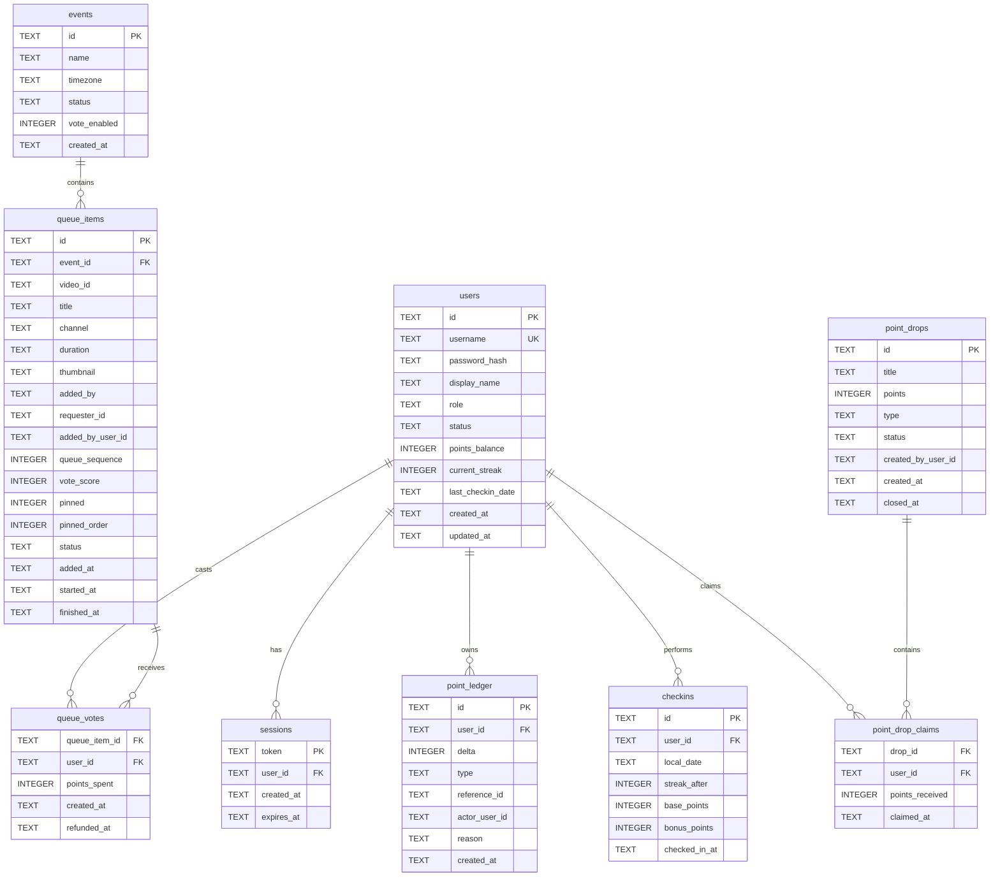
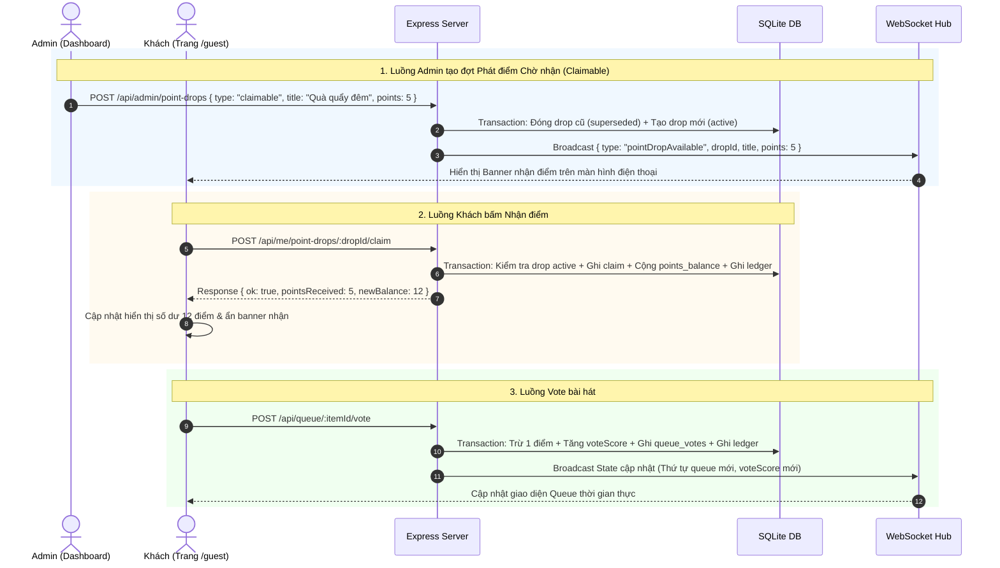

# Thiết kế nghiệp vụ & Kỹ thuật: Tài khoản, Điểm danh, Vote hàng đợi và Phát điểm Admin

## 1. Mục tiêu & Định hướng Kiến trúc

Bổ sung một lớp tài khoản, kinh tế điểm thưởng và bình chọn (vote) bài hát cho hệ thống Jukebox sự kiện:

- **Tính tương thích ngược**: Khách (Guest) không cần đăng ký tài khoản vẫn quét QR, tìm kiếm, thêm bài và theo dõi hàng đợi bình thường.
- **Tài khoản & Điểm danh**: Thành viên đăng ký có thể điểm danh hàng ngày nhận điểm, duy trì chuỗi liên tục (streak) để nhận điểm thưởng mốc.
- **Vote bài hát**: Dùng điểm cá nhân để vote tăng thứ hạng bài hát trong hàng đợi.
- **Tự động sắp xếp hàng đợi**: Hàng đợi tự động ưu tiên bài theo `pinned` (ghim của Host) $\rightarrow$ `voteScore` (giảm dần) $\rightarrow$ `queueSequence` (thêm sớm phát trước).
- **Tính năng Admin phát điểm toàn server**:
  1. _Phát trực tiếp (Direct Airdrop)_: Cộng điểm đồng loạt tức thì cho toàn bộ tài khoản đang active.
  2. _Phát dạng chờ nhận (Claimable Point Drop)_: Tạo đợt quà tặng yêu cầu user chủ động vào nhận trên UI. Nếu Admin tạo đợt phát điểm mới, đợt cũ chưa nhận sẽ tự động hết hạn (**không cộng dồn** để nhận bù).
- **Lưu trữ bền vững (Persistence & Single Source of Truth)**: Dùng SQLite (`data/jukebox.db`) làm nguồn dữ liệu chuẩn mực duy nhất, đảm bảo tính toàn vẹn (ACID transaction) cho điểm, vote, user và queue qua các lần khởi động lại server.

---

## 2. Giải pháp Kỹ thuật & Loại bỏ Rào cản (Blockers Resolution)

### 2.1 Single Source of Truth (SSOT): SQLite Transaction + In-Memory Cache

- **Nguyên tắc**: SQLite là nguồn chân lý duy nhất (SSOT) cho mọi giao dịch tài chính/điểm, auth và queue items.
- **Cơ chế đồng bộ**:
  - Các tác vụ ghi (Check-in, Vote, Add song, Remove, Advance, Point Drop, Admin adjust) bắt buộc thực thi trong SQLite Transaction (`BEGIN IMMEDIATE TRANSACTION`).
  - Sau khi transaction commit thành công, trạng thái bộ nhớ (`JukeboxState`) được cập nhật đồng bộ và broadcast snapshot tới toàn bộ client qua WebSocket.
  - Khi server khởi động, `JukeboxState` tự động nạp lại danh sách bài hát chưa phát (`status = 'queued'`) và bài đang phát (`status = 'playing'`) từ SQLite.

### 2.2 Giải quyết Xung đột: Kéo-thả của Host vs Xếp hàng theo Vote

- **Vấn đề**: Khi bật "Xếp theo vote", việc vote mới có thể ghi đè vị trí bài hát mà Host vừa kéo thả bằng tay.
- **Quy tắc giải quyết**:
  1. Mỗi mục trong hàng đợi có 2 trạng thái sắp xếp: `pinned` (0 hoặc 1) và `pinned_order` (thứ tự ghim của Host).
  2. Khi Host kéo thả một bài hát trên UI máy chiếu (`reorder`/`move`), bài hát đó được đánh dấu `pinned = 1` và gán `pinned_order` tương ứng.
  3. Thứ tự ưu tiên sắp xếp hàng đợi phát nhạc:
     $$\text{Thứ tự} = (\text{pinned DESC}, \text{pinned\_order ASC}, \text{vote\_score DESC}, \text{queue\_sequence ASC})$$
  4. Host có quyền bấm nút **Bỏ ghim (Unpin)** để đưa bài hát trở lại xếp theo điểm vote tự nhiên.

### 2.3 Chuẩn hoá Môi trường Runtime & Zero-Dependency

- **Runtime**: Chạy trên **Bun** (`oven/bun:1-alpine`), sử dụng module `bun:sqlite` tích hợp sẵn với hiệu năng cực cao và không cần cài đặt thêm external C++ native build.
- **Mật khẩu an toàn**: Sử dụng module chuẩn `node:crypto.scryptSync` (hoặc `node:crypto.scrypt`) kèm random salt 16 bytes. Tuyệt đối không lưu plaintext.
- **Quản lý Phiên (Sessions)**: Lưu session token (32 bytes hex) trong bảng `sessions` của SQLite, gửi về client qua cookie `HttpOnly; SameSite=Lax; Path=/`.

### 2.4 Timezone & Quản lý Ngày Điểm Danh

- **Timezone chuẩn**: Mặc định `Asia/Ho_Chi_Minh` (UTC+7), cấu hình qua biến môi trường `APP_TIMEZONE`.
- Ngày điểm danh (`local_date`) được tính bằng định dạng `YYYY-MM-DD` theo đúng timezone cấu hình ở tầng server, độc lập hoàn toàn với client timezone hay múi giờ UTC của Docker container.

---

## 3. Quy tắc Nghiệp vụ Chi tiết

### 3.1 Tài khoản & Phân quyền

1. **Đăng ký / Đăng nhập**: Tối giản bằng `username` (duy nhất, không phân biệt hoa thường, 3–30 ký tự) + `password` (tối thiểu 6 ký tự) + `display_name` (tùy chọn, mặc định lấy username).
2. **Vai trò (Roles)**:
   - `user`: Thành viên thông thường.
   - `admin`: Quản trị viên (quản lý user, cộng/trừ điểm, phát điểm, quản trị feedback).
3. **Trạng thái (Status)**:
   - `active`: Hoạt động bình thường.
   - `blocked`: Bị khóa. Tài khoản bị khóa sẽ bị hủy session, từ chối đăng nhập, không thể điểm danh hay vote thêm bài mới. (Các vote cũ đã nằm trong queue vẫn giữ nguyên để không làm loạn thứ tự realtime của sự kiện).
4. **Phân định quyền Host và Admin**:
   - **Host máy chiếu (`/`)**: Tiếp tục dùng Basic Auth qua `HOST_PASSWORD` và WebSocket host token để tiện lợi cho việc cắm máy chiếu sự kiện mà không cần đăng nhập tài khoản cá nhân.
   - **Admin quản trị (`/admin`)**: Đăng nhập bằng tài khoản `users` có `role = 'admin'` thông qua Cookie Session.

### 3.2 Khách (Guest) & Trải nghiệm Người dùng

- Khách không đăng nhập vẫn quét mã QR, tìm kiếm, nghe nhạc, chat, gửi góp ý và thêm bài hát vào hàng đợi.
- Khách được nhận diện bằng `clientId` trong `localStorage`.
- Khách chưa đăng nhập không có điểm và không thể vote. Khi bấm nút vote, hiển thị modal/thông báo mời đăng nhập hoặc đăng ký.
- Khi một khách đăng nhập vào tài khoản, `clientId` vẫn được giữ nguyên. Tên hiển thị của tài khoản tự động điền vào ô "Tên order" trên giao diện `/guest`.

### 3.3 Điểm danh Hằng ngày (Daily Check-in & Streak)

- Mỗi tài khoản chỉ được điểm danh **1 lần duy nhất** trong mỗi ngày lịch (`local_date`).
- **Điểm cơ bản**: Mỗi lần điểm danh nhận `+1 điểm`.
- **Chuỗi liên tục (Streak)**:
  - Nếu điểm danh vào ngày liền kề sau ngày điểm danh gần nhất (`last_checkin_date` = hôm qua) $\rightarrow$ `streak = streak + 1`.
  - Nếu bỏ lỡ từ 1 ngày trở lên $\rightarrow$ `streak` trở về `1`.
- **Thưởng mốc (Milestone Bonus)**:
  - Mốc ngày 3: `+2 điểm` thưởng.
  - Mốc ngày 7: `+5 điểm` thưởng.
  - Mốc ngày 14: `+10 điểm` thưởng.
  - Mốc ngày 30: `+20 điểm` thưởng.
  - _Sau ngày 30_: Tiếp tục duy trì streak, mỗi ngày nhận `+1 điểm` cơ bản, chu kỳ thưởng mốc lặp lại theo modulo 30 (ví dụ ngày 33 nhận bonus mốc 3, ngày 60 nhận bonus mốc 30) để tạo động lực duy trì lâu dài.
- Thao tác điểm danh là **Idempotent**: Gọi lại nhiều lần trong cùng ngày chỉ trả về kết quả đã điểm danh hôm nay, không cộng thêm điểm và không báo lỗi 500.

### 3.4 Điểm và Bình chọn Hàng đợi (Voting)

- **Chi phí**: 1 vote tiêu tốn 1 điểm từ số dư (`points_balance`) của tài khoản.
- **Giới hạn vote**: Mỗi tài khoản chỉ có tối đa **1 vote đang hoạt động cho một bài hát**. Một tài khoản có thể dùng điểm để vote cho nhiều bài hát khác nhau.
- **Điều kiện vote**:
  - Tài khoản đang `active` và có `points_balance >= 1`.
  - Bài hát đang ở trạng thái chờ phát (`status = 'queued'`). Không được vote cho bài đang phát (`status = 'playing'`) hoặc bài đã kết thúc/đã bị xóa.
- **Chính sách Rút vote**: **Không hỗ trợ rút vote** giữa chừng để tránh tình trạng đầu cơ điểm (vote đẩy bài lên đầu rồi sát giờ phát rút điểm lại để vote bài khác).
- **Chính sách Hoàn điểm (`vote_refund`)**:
  - Khi bài hát bị xóa khỏi hàng đợi (dù do Host xóa hay do Người thêm bài tự xóa qua `removeOwn`), hệ thống **tự động hoàn trả 100% điểm** cho tất cả người dùng đã vote cho bài đó.
  - Khi bài hát đã phát xong hoặc bị Host bấm Skip trong lúc đang phát: **Không hoàn điểm**.
  - Khi video gặp lỗi không phát được trên YouTube iframe (mã lỗi 101/150): Server tự động chuyển bài và hoàn điểm cho các thành viên đã vote bài lỗi đó.

### 3.5 Tính năng Admin Phát điểm Toàn Server (Airdrop & Point Drops)

Admin có 2 hình thức phát điểm cho cộng đồng:

#### Hình thức 1: Phát điểm Trực tiếp (Direct Airdrop)

- **Mục đích**: Tặng điểm ngay lập tức cho tất cả mọi người (ví dụ: mừng khai mạc sự kiện).
- **Hành vi**:
  - Admin nhập số điểm $N$ và lý do.
  - Hệ thống chạy 1 transaction duy nhất: cộng $N$ điểm vào `points_balance` của toàn bộ tài khoản có `status = 'active'`.
  - Tự động ghi bản ghi vào `point_ledger` cho từng user với `type = 'airdrop_direct'`.
  - Gửi broadcast WebSocket để cập nhật số dư điểm realtime cho tất cả user đang online.

#### Hình thức 2: Phát điểm Chờ nhận (Claimable Point Drop)

- **Mục đích**: Tặng quà tương tác, tạo hứng thú cho người tham gia đang trực tiếp theo dõi sự kiện.
- **Hành vi**:
  - Admin tạo một đợt phát điểm mới gồm: Tiêu đề (ví dụ: "Quà tặng quẩy đêm 🎉"), Số điểm $N$.
  - Khi tạo đợt mới, hệ thống tự động đánh dấu tất cả các đợt claimable drop đang active trước đó thành `superseded` (hết hạn).
  - Client `/guest` nhận thông báo WebSocket và hiển thị banner/hộp quà nổi bật: _"Admin đang phát N điểm! Bấm để nhận"_.
  - Người dùng đăng nhập bấm nút **"Nhận điểm" (Claim)**:
    - Kiểm tra đợt drop còn active hay không.
    - Kiểm tra user đã nhận đợt này chưa (thông qua bảng `point_drop_claims`).
    - Cộng $N$ điểm vào tài khoản user, ghi ledger `type = 'point_drop_claim'`.
  - **Quy tắc Không cộng dồn (Non-Stackable)**: Nếu user không vào nhận trong thời gian đợt drop đang mở, khi Admin tạo đợt drop mới hoặc đóng sự kiện, đợt cũ sẽ biến mất vĩnh viễn. User **không thể nhận bù** các đợt đã qua.

---

## 4. Mô hình Dữ liệu SQLite (`data/jukebox.db`)

### Chi tiết các Bảng & Ràng buộc:

1. **`users`**:
   - `id`: TEXT PRIMARY KEY
   - `username`: TEXT UNIQUE NOT NULL (stored lowercase)
   - `password_hash`: TEXT NOT NULL
   - `display_name`: TEXT NOT NULL
   - `role`: TEXT NOT NULL DEFAULT 'user' (`user` | `admin`)
   - `status`: TEXT NOT NULL DEFAULT 'active' (`active` | `blocked`)
   - `points_balance`: INTEGER NOT NULL DEFAULT 0 (CHECK `points_balance >= 0`)
   - `current_streak`: INTEGER NOT NULL DEFAULT 0
   - `last_checkin_date`: TEXT (định dạng `YYYY-MM-DD`)
   - `created_at`: TEXT NOT NULL, `updated_at`: TEXT NOT NULL

2. **`sessions`**:
   - `token`: TEXT PRIMARY KEY
   - `user_id`: TEXT NOT NULL REFERENCES `users(id)` ON DELETE CASCADE
   - `expires_at`: TEXT NOT NULL, `created_at`: TEXT NOT NULL

3. **`point_ledger`** (Audit log bất biến):
   - `id`: TEXT PRIMARY KEY
   - `user_id`: TEXT NOT NULL REFERENCES `users(id)`
   - `delta`: INTEGER NOT NULL (âm hoặc dương)
   - `type`: TEXT NOT NULL (`daily_checkin`, `streak_bonus`, `vote_spend`, `vote_refund`, `admin_adjustment`, `airdrop_direct`, `point_drop_claim`)
   - `reference_id`: TEXT (queue_item_id, drop_id, hoặc idempotency key)
   - `actor_user_id`: TEXT (admin ID nếu do admin thực hiện)
   - `reason`: TEXT
   - `created_at`: TEXT NOT NULL

4. **`checkins`**:
   - `id`: TEXT PRIMARY KEY
   - `user_id`: TEXT NOT NULL REFERENCES `users(id)`
   - `local_date`: TEXT NOT NULL (`YYYY-MM-DD`)
   - `streak_after`: INTEGER NOT NULL
   - `base_points`: INTEGER NOT NULL DEFAULT 1
   - `bonus_points`: INTEGER NOT NULL DEFAULT 0
   - `checked_in_at`: TEXT NOT NULL
   - **UNIQUE (`user_id`, `local_date`)**

5. **`point_drops`**:
   - `id`: TEXT PRIMARY KEY
   - `title`: TEXT NOT NULL
   - `points`: INTEGER NOT NULL (CHECK `points > 0`)
   - `type`: TEXT NOT NULL (`direct` | `claimable`)
   - `status`: TEXT NOT NULL DEFAULT 'active' (`active` | `closed` | `superseded`)
   - `created_by_user_id`: TEXT NOT NULL REFERENCES `users(id)`
   - `created_at`: TEXT NOT NULL, `closed_at`: TEXT

6. **`point_drop_claims`**:
   - `drop_id`: TEXT NOT NULL REFERENCES `point_drops(id)`
   - `user_id`: TEXT NOT NULL REFERENCES `users(id)`
   - `points_received`: INTEGER NOT NULL
   - `claimed_at`: TEXT NOT NULL
   - **PRIMARY KEY (`drop_id`, `user_id`)**

7. **`queue_items`**:
   - `id`: TEXT PRIMARY KEY
   - `event_id`: TEXT NOT NULL DEFAULT 'default_event'
   - `video_id`: TEXT NOT NULL
   - `title`: TEXT NOT NULL, `channel`: TEXT, `duration`: TEXT, `thumbnail`: TEXT
   - `added_by`: TEXT NOT NULL
   - `requester_id`: TEXT NOT NULL (clientId của thiết bị)
   - `added_by_user_id`: TEXT REFERENCES `users(id)` (nullable nếu guest thêm)
   - `queue_sequence`: INTEGER NOT NULL (tự tăng theo thời gian thêm)
   - `vote_score`: INTEGER NOT NULL DEFAULT 0
   - `pinned`: INTEGER NOT NULL DEFAULT 0
   - `pinned_order`: INTEGER NOT NULL DEFAULT 0
   - `status`: TEXT NOT NULL DEFAULT 'queued' (`queued` | `playing` | `played` | `removed` | `error`)
   - `added_at`: INTEGER NOT NULL, `started_at`: INTEGER, `finished_at`: INTEGER

8. **`queue_votes`**:
   - `queue_item_id`: TEXT NOT NULL REFERENCES `queue_items(id)`
   - `user_id`: TEXT NOT NULL REFERENCES `users(id)`
   - `points_spent`: INTEGER NOT NULL DEFAULT 1
   - `created_at`: TEXT NOT NULL, `refunded_at`: TEXT
   - **PRIMARY KEY (`queue_item_id`, `user_id`)**

---

## 5. Thiết kế API Chi tiết

### 5.1 Xác thực & Thông tin Cá nhân

- `POST /api/auth/register`
  - Body: `{ username, password, displayName }`
  - Response: `{ ok: true, user: { id, username, displayName, role, pointsBalance } }` (Gắn Cookie Session).
- `POST /api/auth/login`
  - Body: `{ username, password }`
  - Response: `{ ok: true, user: { ... } }` (Gắn Cookie Session).
- `POST /api/auth/logout`
  - Response: `{ ok: true }` (Xóa Cookie Session và bản ghi trong DB).
- `GET /api/me`
  - Response: `{ ok: true, authenticated: boolean, user: { id, username, displayName, role, pointsBalance, currentStreak, hasCheckedInToday, activeClaimableDrop } }`

### 5.2 Điểm danh & Nhận Quà (Point Drops)

- `POST /api/me/checkin`
  - Response: `{ ok: true, streak: number, pointsAwarded: number, newBalance: number, isMilestone: boolean }`
- `GET /api/me/points/history?page=1&limit=20`
  - Response: `{ ok: true, ledger: [{ id, delta, type, reason, createdAt }] }`
- `GET /api/me/point-drops/active`
  - Response: `{ ok: true, drop: { id, title, points } | null, alreadyClaimed: boolean }`
- `POST /api/me/point-drops/:dropId/claim`
  - Response: `{ ok: true, pointsReceived: number, newBalance: number }`

### 5.3 Bình chọn (Voting)

- `POST /api/queue/:itemId/vote`
  - Headers: Cookie session bắt buộc
  - Response: `{ ok: true, newVoteScore: number, newBalance: number }`
  - Transaction xử lý:
    1. Kiểm tra session & `user.status === 'active'`.
    2. Kiểm tra `user.points_balance >= 1`.
    3. Kiểm tra bài hát tồn tại và `status === 'queued'`.
    4. Kiểm tra user chưa từng vote bài này (`SELECT 1 FROM queue_votes WHERE queue_item_id = ? AND user_id = ?`).
    5. INSERT `queue_votes`, UPDATE `queue_items.vote_score = vote_score + 1`.
    6. UPDATE `users.points_balance = points_balance - 1`.
    7. INSERT `point_ledger` (`type = 'vote_spend'`).
    8. Tính lại thứ tự queue và broadcast snapshot WebSocket.

### 5.4 Quản trị Admin (`/api/admin/*`)

_Yêu cầu Session Cookie của tài khoản có role `admin`._

- `GET /api/admin/users?search=&status=&page=&limit=`
  - Trả về danh sách user, số dư điểm, streak, ngày check-in cuối, trạng thái.
- `POST /api/admin/users/:id/points`
  - Body: `{ delta: number, reason: string }`
  - Cộng/trừ điểm thủ công, bắt buộc kèm lý do để ghi ledger audit.
- `PATCH /api/admin/users/:id`
  - Body: `{ status: 'active' | 'blocked', role: 'user' | 'admin' }`
- `GET /api/admin/users/:id/ledger`
  - Xem chi tiết toàn bộ lịch sử biến động điểm của user.
- `POST /api/admin/point-drops`
  - Body: `{ type: 'direct' | 'claimable', title: string, points: number }`
  - Nếu `type === 'direct'`: Cộng điểm toàn server ngay lập tức.
  - Nếu `type === 'claimable'`: Tạo đợt nhận điểm mới, đóng đợt cũ, gửi broadcast WebSocket.
- `GET /api/admin/point-drops`
  - Lịch sử các đợt phát điểm và thống kê số lượng user đã claim.

---

## 6. Luồng Dữ liệu & Giao diện Người dùng

### 6.1 Cập nhật Giao diện Khách (`/guest`)

1. **Header**:
   - Khi chưa đăng nhập: Nút `[Đăng nhập / Đăng ký]` nhỏ gọn.
   - Khi đã đăng nhập: `[Tên hiển thị] · [Số dư] 🪙` + Nút menu cá nhân.
2. **Khu vực Điểm danh & Quà tặng**:
   - Thẻ điểm danh: Hiển thị số ngày streak hiện tại, trạng thái "Hôm nay đã điểm danh" hoặc nút "Điểm danh ngay (+1 điểm)".
   - Banner Quà tặng (Point Drop): Xuất hiện động khi có đợt drop active, kèm nút "Nhận ngay +N điểm". Tự động biến mất sau khi nhận.
3. **Danh sách Hàng đợi (Queue Item)**:
   - Mỗi bài hát hiển thị huy hiệu vote: `❤️ N vote`.
   - Nút `[Vote +1]`: Nếu đã vote hiển thị `[Đã Vote]`; nếu chưa đăng nhập hoặc hết điểm hiển thị tooltip hướng dẫn thân thiện.

### 6.2 Cập nhật Giao diện Host (`/`)

- Cài đặt Host: Nút bật/tắt `Xếp hàng theo vote` (Mặc định: BẬT).
- Hiển thị điểm `voteScore` cạnh từng bài hát trong danh sách hàng đợi.
- Hiển thị biểu tượng `📌 Ghim` cho các bài hát do Host kéo thả sắp xếp thủ công.
- Nút `✕ Bỏ ghim` để đưa bài hát trở lại vị trí xếp theo điểm tự nhiên.

### 6.3 Giao diện Quản trị (`/admin`)

- Tích hợp trang `/feedback` hiện tại thành bảng điều khiển thống nhất `/admin`:
  - **Tab 1: Quản lý Thành viên**: Tìm kiếm user, xem số dư, streak, nút cộng/trừ điểm kèm popup lý do, nút Khóa/Mở khóa tài khoản.
  - **Tab 2: Phát điểm Toàn Server (Airdrop)**:
    - Form phát trực tiếp (Direct): Nhập điểm, lý do $\rightarrow$ Thực thi.
    - Form phát chờ nhận (Claimable): Nhập tiêu đề, điểm $\rightarrow$ Phát sóng realtime tới mọi thiết bị.
    - Bảng thống kê các đợt phát trước đó (số người đã nhận, trạng thái).
  - **Tab 3: Lịch sử Ledger**: Tra cứu toàn bộ biến động điểm hệ thống.
  - **Tab 4: Góp ý & Cấu hình**: Giữ nguyên tính năng duyệt góp ý và cấu hình bộ lọc sự kiện.

---

## 7. Kế hoạch Triển khai Từng Bước (Implementation Plan)

### Phase 0: Hạ tầng Dữ liệu SQLite & Repository Layer

- Khởi tạo `src/db.js` kết nối `bun:sqlite` tại `data/jukebox.db`.
- Thiết lập tự động chạy DDL migration khi boot server.
- Xây dựng module `src/repositories/` xử lý an toàn các transaction cho Users, Ledger, Votes, Drops, Queue.
- Đảm bảo toàn bộ luồng Guest cũ hoạt động trơn tru không lỗi.

### Phase 1: Authentication, Session & Daily Check-in

- Cài đặt `POST /api/auth/register`, `/login`, `/logout`, `GET /api/me`.
- Cài đặt `POST /api/me/checkin` với thuật toán tính streak và thưởng mốc theo timezone `Asia/Ho_Chi_Minh`.
- Cập nhật UI Header `/guest`: modal Auth và widget điểm danh.

### Phase 2: Voting Engine & Tự động Sắp xếp Hàng đợi

- Cài đặt `POST /api/queue/:itemId/vote`.
- Nâng cấp `src/state.js` để đọc/ghi qua DB và hỗ trợ thuật toán sắp xếp đa tầng (`pinned` $\rightarrow$ `voteScore` $\rightarrow$ `sequence`).
- Triển khai cơ chế tự động hoàn điểm (`vote_refund`) khi bài bị xóa bởi Host hoặc Guest creator.
- Cập nhật UI Host và Guest hiển thị điểm vote và đồng bộ WebSocket realtime.

### Phase 3: Quản trị Admin & Tính năng Phát điểm Toàn Server

- Xây dựng bảng điều khiển `/admin` với đầy đủ tab Quản lý User, Ledger Audit, Feedback.
- Triển khai tính năng Admin Phát điểm Trực tiếp (Direct Airdrop).
- Triển khai tính năng Admin Phát điểm Chờ nhận (Claimable Point Drop) kèm cơ chế không cộng dồn (non-stackable) và thông báo WebSocket.

### Phase 4: Kiểm thử Tải, Đồng thời & Hoàn thiện

- Viết automated test (`tests/`) cho:
  - Chống race-condition / double vote / double check-in.
  - Test hoàn điểm khi xóa bài có nhiều vote.
  - Test phát điểm đồng loạt cho nhiều user.
  - Test server restart bảo toàn 100% queue, vote và số dư.
