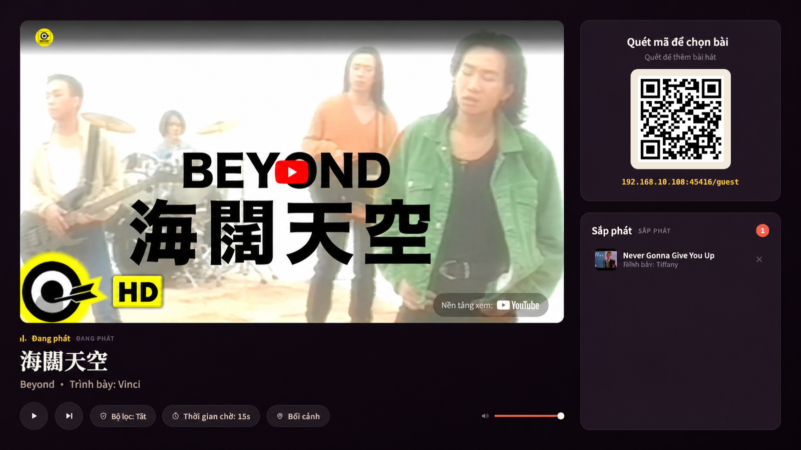
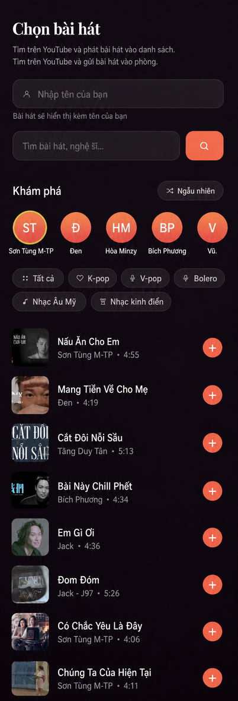

# 🎶 Office Jukebox

**Turn any projector into a crowd-controlled jukebox.**

Guests scan a QR code, search YouTube from their phones, and add songs to the
queue. Music plays on the big screen, with an optional AI DJ that evaluates
requests against the occasion.

<em>Projected host screen: player, scannable QR code, and live queue with requester names.</em>

## Why this exists

Party music usually fails in one of two ways: one person DJs all night, or the
queue fills with memes and worse. This project is the middle ground. Guests can
add songs from their phones in seconds (no app and no account required), while
the host retains enough control to skip, remove, rate-limit, and optionally use
an LLM filter that understands the difference between a school dinner and a
nightclub.

It was built for a real graduation dinner in Hong Kong and designed for any
event.

## Features

- 📱 Instant requests — scan QR, search, and tap. No app or login required.
- 🔑 No YouTube API key — search reads public result pages and playback uses the
  standard embedded player.
- 🎤 KTV-style discovery — genre tabs for K-pop, V-pop, Vietnamese bolero,
  Western music, party music, and Vietnamese classics, plus singer chips with
  fresh real results.
- 🤖 Optional AI content filter — any OpenAI-compatible LLM can evaluate requests
  using event context, YouTube category, family-safety flags, and descriptions.
  The projector controls off, on, and strict modes.
- 🎛 Live host controls — play/pause/skip, removal, per-guest cooldown,
  filter mode, and event context, persisted across restarts.
- 💬 Guest feedback at /guest, with review, deletion, toggle, and statistics
  controls at /feedback.
- 🧠 Optional autonomous AI chat with bounded context, rolling summaries, expiring
  event memory, and admin-controlled behavior.
- 🔒 Optional host password protecting the projector page and WebSocket controls.
- 🛡 Queue guardrails — duplicate detection, per-phone rate limits, a 50-song
  queue cap, playability checks, and a no-start watchdog.
- ⚡ Realtime state broadcast to the projector and every guest phone.
- 👤 Optional accounts for daily check-ins, streaks, points, and voting.
- 🏆 Public XP leaderboard at `/leaderboard`, linked compactly from the guest page.
- 🎁 Admin dashboard for members, points, airdrops, ledger, feedback, and chat.

<em>Guest mobile page: name, search, singer chips, and one-tap requests.</em>

## Language policy

Developer-facing documentation, code comments, test descriptions, configuration
comments, and operational logs use English. User-facing UI copy, API reasons
surfaced to users, AI responses shown in chat, and song or artist metadata remain
Vietnamese or in their original language by product decision.

## Quick start

~~~bash
git clone https://github.com/Hangton-Code/event-music-system.git
cd event-music-system
bun install
cp .env.example .env      # defaults are usable; the AI filter is off
# set a strong ADMIN_PASSWORD in .env if /admin is needed
bun start
~~~

Open http://localhost:45416/ on the host machine, move the window to the
projector, and press “Bắt đầu” once so the browser allows audio. Guests scan the
QR code on the screen.

Bun is required because SQLite uses the built-in bun:sqlite module.

## How it works

~~~
   Projector (laptop / server)        Guest phone
  ┌────────────────────┐             ┌──────────────┐
  │  ▶ Đang phát       │   scan QR   │  🔍 tìm kiếm │
  │  [ YouTube video ] │  ◀───────▶  │  + thêm bài  │
  │  ▣ QR   Sắp phát ▤▤│   Wi-Fi     │  hàng đợi    │
  └────────────────────┘             └──────────────┘
            │ audio → venue AV system
~~~

| Path | Purpose |
|------|---------|
| / | Host/projector page: player, QR code, queue, and controls |
| /guest | Guest mobile page opened through the QR code |
| /leaderboard | Public Top 10 XP leaderboard |
| /feedback | Redirects to the feedback tab in /admin |
| /admin | Account, points, airdrop, ledger, feedback, and chat dashboard |
| GET /api/search?q= | Read YouTube search results without an API key |
| GET /api/browse?q= | Cached single-track search used by discovery tabs |
| POST /api/request | Guardrails, playability check, optional AI filter, and queue insertion |
| POST /api/feedback | Save guest feedback when enabled |
| GET/PATCH/DELETE /api/feedback | Host feedback statistics, listing, toggling, and deletion |
| WebSocket / | Broadcast queue state and carry host controls |

Direct search prioritizes a Vietnam-like YouTube Music context. If the primary
result set is too small, the server supplements it with a Songs-filtered query.
Discovery tabs use only the Songs query and do not use login cookies.

The queue server in src/state.js is authoritative. The projector is only a
player: when a song ends or errors, it reports the event to the server, which
promotes the next item and broadcasts the new state. Accounts, points, votes, and
the queue are stored in data/jukebox.db; projector settings are stored in
data/settings.json.

The request pipeline is overflow protection → duplicate/cooldown checks → oEmbed
playability check → optional LLM decision → queue insertion. Videos that are
embed-disabled or region-locked but pass the first check are automatically
skipped by the player through iframe error handling and a 20-second no-start
watchdog.

## AI content filter

The filter is off by default and can be cycled from the projector page with the
“Bộ lọc” button: “tắt → bật → nghiêm ngặt”. It works with any OpenAI-compatible
chat API, including OpenRouter, Kimi/Moonshot, DeepSeek, and GLM.

~~~ini
LLM_API_KEY=sk-...
LLM_BASE_URL=https://openrouter.ai/api/v1
LLM_MODEL=deepseek/deepseek-v4-flash
~~~

Verify the key and list available models with bun run check-llm.

Set event context with the “Bối cảnh” button so the filter can apply an
appropriate standard. “Nghiêm ngặt” ignores the venue and permits only
family-safe music. Infrastructure failures are allowed so moderation never
stops the party; a model response that avoids a structured verdict is rejected.

The filter reads titles, channels, categories, and descriptions, not audio. On
OpenRouter, LLM_WEB_SEARCH=true enables web search for each song and evaluation
of actual lyrics, at roughly $0.005 per moderated request with extra latency.

## Autonomous AI chat

AI chat is off by default and is managed in the “Góp ý & Chat” tab at /admin.
User messages are broadcast immediately; AI work runs in the background and
provider failures are recorded for admins without interrupting chat.

Chat is stored in SQLite and retains roughly the latest 5,000 messages per event.
The client receives only the latest 40 messages, while the AI can read a history
within the configured character budget. Older content becomes a rolling summary;
stable facts, preferences, decisions, and topics can become sourced, expiring
memory. The AI cannot add/remove songs, adjust points, or use admin privileges.

If CHAT_AI_API_KEY is empty, chat AI falls back to the filter's LLM_* values:

~~~ini
CHAT_AI_API_KEY=sk-...
CHAT_AI_BASE_URL=https://flowgiare.com/v1
CHAT_AI_MODEL=antigravity/gemini-3.7-flash-high
~~~

API keys belong only in the .env file on the running machine. When AI is enabled,
chat content and relevant context may be sent to the configured provider; the
guest UI displays this notice in the chat panel.

## Self-hosting with Docker and a reverse proxy

The server builds its own image from source — no registry or login is required:

~~~bash
git clone https://github.com/Hangton-Code/event-music-system.git
cd event-music-system
cp .env.example .env          # set PUBLIC_URL to your domain and configure HOST_PASSWORD
docker compose up -d --build
~~~

The container joins the external reverseproxy Docker network and exposes port
45416. Point the reverse proxy at event-music:45416, set PUBLIC_URL to your
domain, set `TRUST_PROXY=1` when exactly one trusted proxy sits in front of the
app, and ensure the proxy forwards WebSocket upgrades. Projector settings are
stored in ./data. The default `TRUST_PROXY=false` is safer for direct/LAN access;
existing deployments should add the setting explicitly so IP-based limits are
applied to the original client address instead of the proxy.

The reverseproxy network must already exist. If it does not:
docker network create reverseproxy.

### Updating the system

Push to deploy (recommended): a self-hosted GitHub Actions runner rebuilds after
every push to main. Register a Linux runner, grant its account Docker access, and
set the DEPLOY_DIR repository variable if the clone is not at
/root/scripts/event-music-system (the workflow default).

Manual: run git pull && docker compose up -d --build whenever needed.

Cron: update.sh pulls and rebuilds only when the revision changes. Use a runner
or cron, not both.

Security note: this public-repository workflow runs only for direct pushes to
main or manual dispatch, never for pull_request, so forks cannot execute code on
the self-hosted runner.

## ⚠️ The most common event failure: networking

Guest phones must be able to reach the server. Many venue or guest Wi-Fi
networks block traffic between devices (client isolation), so the QR code appears
not to work even when the configuration is correct.

Reliable options are exposing the server through a domain, creating a dedicated
hotspot, or bringing a travel router. The event server always needs Internet
access for YouTube playback.

## Configuration

All configuration lives in .env; see .env.example for the complete list and
comments.

| Variable | Purpose |
|----------|---------|
| PUBLIC_URL | Public address used by the QR code behind the reverse proxy |
| HOST_PASSWORD | Protects the projector page and controls |
| ADMIN_USERNAME / ADMIN_PASSWORD | Creates the first admin account before startup |
| APP_TIMEZONE | Time zone used for check-in dates |
| LLM_API_KEY / LLM_BASE_URL / LLM_MODEL | OpenAI-compatible content-filter provider |
| CHAT_AI_API_KEY / CHAT_AI_BASE_URL / CHAT_AI_MODEL | Chat provider, falling back to LLM_* when its key is empty |
| EVENT_CONTEXT | Initial event description sent to the AI |
| TRUST_PROXY | Trusted reverse-proxy hop count for client-IP rate limits (default `false`) |
| WS_MAX_CONNECTIONS_PER_IP | Concurrent WebSocket connections allowed per effective client IP (default `200`) |
| WS_MAX_MESSAGES_PER_IP | Aggregate WebSocket messages per effective client IP per minute (default `600`) |
| WS_MAX_TRACKED_IPS | Maximum inactive IP limiter records retained in memory (default `5000`) |
| PORT | Listening port, default 45416 |

Filter status, moderation mode, cooldown, event context, and chat AI behavior are
stored in data/settings.json. Provider, key, and model values remain only in
.env; chat history, summaries, and memory are in data/jukebox.db.

## Project layout

~~~
server.js                  Express + WebSocket server, request pipeline, settings
src/youtube.js             Keyless search, oEmbed checks, watch-page metadata
src/moderation.js          OpenAI-compatible LLM content filter
src/state.js               Authoritative in-memory queue state
src/net.js                 LAN IP detection
public/host.*              Projector page (player, QR, controls)
public/guest.*             Mobile page (search, discovery, live queue)
public/leaderboard.*       Public XP leaderboard page
scripts/check-llm.mjs      Verify the LLM key and list models
Dockerfile                 Bun-based image
docker-compose.yml         Home-server deployment (local build)
update.sh                  Cron alternative: pull and rebuild on revision changes
~~~

There is no framework or build step, and only three runtime dependencies:
express, ws, and qrcode. The project is intentionally small enough to read in an
afternoon.

## License

[MIT](LICENSE) — please use responsibly when organizing a party. 🎉
