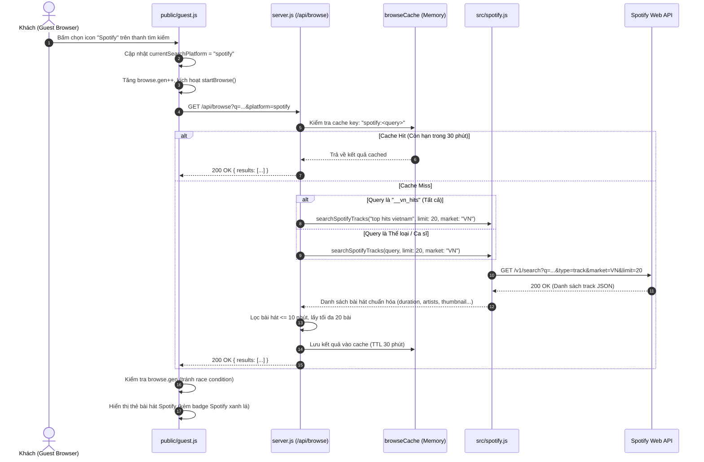

# Bản thiết kế kỹ thuật: Tính năng Khám phá nhạc Spotify trên trang Guest

- **Ngày tạo:** 2026-09-24
- **Trạng thái:** Bản thiết kế hoàn chỉnh (Spec Validated)
- **Tác giả:** Antigravity AI & Laztar Team
- **Mục tiêu:** Mở rộng toàn diện phần "Khám phá" (Discovery) trên trang Guest (`/guest`) để hỗ trợ chuyển đổi giữa YouTube và Spotify khi khách nhấn vào icon nền tảng trên thanh tìm kiếm, giữ nguyên và hỗ trợ đầy đủ toàn bộ bộ lọc danh mục (Genre Tabs) và ca sĩ (Singer Chips).

---

## 1. Mục tiêu và Yêu cầu Nghiệp vụ

### 1.1. Hiện trạng
- Trang Guest hiện có thanh tìm kiếm với 2 icon nền tảng: **YouTube** và **Spotify**.
- Tuy nhiên, phần "Khám phá" bên dưới thanh tìm kiếm chỉ tải và hiển thị danh sách bài hát từ YouTube (thông qua endpoint `GET /api/browse?q=...`).
- Khi khách chọn icon Spotify trên thanh tìm kiếm, chỉ có ô tìm kiếm chuyển sang chế độ Spotify, còn phần Khám phá bên dưới vẫn hiển thị toàn bộ bài hát YouTube.

### 1.2. Yêu cầu mới
1. Khi khách nhấn vào biểu tượng **Spotify** trên thanh tìm kiếm:
   - Phần Khám phá bên dưới tự động chuyển sang hiển thị toàn bộ bài hát từ **Spotify**.
   - Giữ nguyên bộ lọc danh mục hoặc ca sĩ đang chọn (nếu đang ở "Tất cả" sẽ tải danh sách Top Hits Việt Nam từ Spotify).
2. Hỗ trợ đầy đủ 100% các bộ lọc hiện có:
   - Toàn bộ **Genre Tabs**: *Tất cả*, *V-pop*, *K-pop*, *Nhạc trữ tình / bolero*, *Nhạc Âu Mỹ*, *Nhạc tiệc*, *Nhạc kinh điển*, *Tốt nghiệp*.
   - Toàn bộ hàng **Singer Chips**: hơn 70 ca sĩ thuộc các dòng nhạc khác nhau (Sơn Tùng M-TP, HIEUTHUHAI, Vũ., Taylor Swift, NewJeans, Tuấn Vũ, v.v.).
3. Khi khách nhấn lại biểu tượng **YouTube**:
   - Khám phá lập tức quay về hiển thị bài hát từ YouTube tương ứng với danh mục hiện tại.
4. Mọi tương tác trên thẻ bài hát Spotify trong Khám phá (thêm vào hàng đợi, bỏ phiếu vote, yêu thích, xem thêm, phát ngẫu nhiên) phải hoạt động trơn tru với provider `spotify`.
5. Xử lý triệt để tất cả các tình huống biên (edge cases) và ngoại lệ mạng/API, không chỉ giải quyết happy case.

---

## 2. Kiến trúc Hệ thống & Luồng Dữ liệu



---

## 3. Thiết kế Chi tiết Phía Máy chủ (Backend)

### 3.1. Nâng cấp `searchSpotifyTracks` trong [src/spotify.js](file:///d:/LAZTAR/LAZTAR%20HUB/office-jukebox/src/spotify.js)
- Nâng mức trần của tham số `limit` từ cố định 10 lên linh hoạt tối đa 50 (chuẩn của Spotify Search API):
  ```javascript
  const params = new URLSearchParams({
    q: query.trim(),
    type: "track",
    market: market || "VN",
    limit: String(Math.min(Math.max(1, limit), 50)),
  });
  ```
- Chuẩn hóa đầu ra mỗi bài hát đảm bảo đầy đủ thông tin:
  - `videoId`: Spotify Track ID (22 ký tự base62).
  - `title`: Tên bài hát.
  - `channel`: Chuỗi nghệ sĩ hiển thị (`Artist 1, Artist 2`).
  - `artists`: Mảng tên nghệ sĩ `string[]` (bao gồm cả feat. artists trích xuất từ tiêu đề).
  - `duration`: Thời lượng định dạng `m:ss`.
  - `durationMs`: Thời lượng tính bằng mili-giây.
  - `thumbnail`: URL ảnh album (chọn kích thước phù hợp: 300x300 hoặc ảnh nét nhất).
  - `provider`: `"spotify"`.

### 3.2. Mở rộng Endpoint `GET /api/browse` trong [server.js](file:///d:/LAZTAR/LAZTAR%20HUB/office-jukebox/server.js)
- **Tham số nhận vào:**
  - `q`: Từ khóa truy vấn (tối đa 100 ký tự).
  - `platform`: `spotify` hoặc `youtube` (mặc định: `youtube`).
- **Phân tách Cache Key:**
  - Định dạng: `${platform}:${q}`.
  - Ngăn ngừa xung đột bộ nhớ cache giữa 2 nền tảng.
- **Xử lý Sentinel `__vn_hits`:**
  - Với YouTube: gọi `fetchVietnamChartHits({ limit: 40 })`.
  - Với Spotify: gọi `searchSpotifyTracks("top hits vietnam", { limit: 20, market: "VN", ... })`.
- **Xử lý các Thể loại & Ca sĩ:**
  - Với YouTube: gọi `searchYouTube(q, { limit: 40, mode: "songs" })`.
  - Với Spotify: gọi `searchSpotifyTracks(q, { limit: 20, market: "VN", ... })`.
- **Lọc và Giới hạn:**
  - Luôn lọc bỏ các bài dài quá 10 phút (`MAX_SINGLE_SECONDS = 600`).
  - Lấy tối đa 20 bài chất lượng nhất cho mỗi lần gọi browse.
- **TTL Cache:** Giữ 30 phút (`BROWSE_TTL_MS = 30 * 60 * 1000`).

---

## 4. Thiết kế Chi tiết Phía Giao diện (Guest Frontend)

### 4.1. Chuyển đổi Nền tảng Tìm kiếm & Khám phá trong [public/guest.js](file:///d:/LAZTAR/LAZTAR%20HUB/office-jukebox/public/guest.js)
- Trong hàm `initSearchPlatformTabs()`:
  - Khi click vào tab Spotify hoặc YouTube:
    ```javascript
    const targetPlatform = tab.dataset.platform || "youtube";
    if (targetPlatform === currentSearchPlatform) return;
    currentSearchPlatform = targetPlatform;
    // Cập nhật trạng thái UI tab
    // Cập nhật placeholder input
    qEl.placeholder = currentSearchPlatform === "spotify" 
      ? "Tìm bài hát hoặc ca sĩ trên Spotify…" 
      : "Tìm bài hát hoặc ca sĩ…";

    const currentQuery = qEl.value.trim();
    if (currentQuery && sugSection.classList.contains("hidden")) {
      // Đang có từ khóa tìm kiếm -> tìm lại với platform mới
      doSearch(currentQuery);
    } else {
      // Đang ở phần Khám phá -> tải lại Khám phá với platform mới
      startBrowse(browse.queries);
    }
    ```

### 4.2. Truyền Platform vào `loadMoreSongs()`
- Sửa lệnh gọi fetch trong `loadMoreSongs()`:
  ```javascript
  const platformParam = currentSearchPlatform === "spotify" ? "&platform=spotify" : "";
  const res = await fetch("/api/browse?q=" + encodeURIComponent(q) + platformParam);
  ```

### 4.3. Ngăn ngừa Race Condition (Click tab nhanh liên tục)
- Cơ chế `browse.gen++` hiện có trong `public/guest.js` được áp dụng chặt chẽ:
  - Khi người dùng đổi platform, `browse.gen` tăng lên.
  - Nếu request trước đó về chậm hơn, client kiểm tra `if (browse.gen !== gen) return;` và lập tức hủy kết quả cũ, bảo đảm không bao giờ có bài YouTube hiển thị lẫn vào Spotify hoặc ngược lại.

### 4.4. Thẻ bài hát & Tương tác
- Thẻ bài hát hiển thị huy hiệu (badge icon) của Spotify:
  - Gọi hàm `getPlatformIconBadge(r.provider)` (đã có sẵn trong `public/guest.js`, trả về icon SVG Spotify xanh lá đặc trưng).
- Tương tác **Thêm vào hàng đợi (`+ Thêm`)**:
  - Gửi request đến `/api/youtube/add` với payload đầy đủ: `provider: "spotify"`, `videoId: r.videoId`, `title: r.title`, `channel: r.channel`, `artists: r.artists`, `duration: r.duration`, `thumbnail: r.thumbnail`.
  - Giữ nguyên các cơ chế giới hạn hàng đợi cá nhân (queue limit), kiểm tra bài trùng, vote score.
- Tương tác **Yêu thích (Favorites)**:
  - Nút tim trên thẻ bài hát Spotify lưu thông tin với `provider: "spotify"`, cho phép khách xem lại trong tab "Yêu thích" và phát lại bất cứ lúc nào.

---

## 5. Toàn diện Xử lý Tình huống Ngoại lệ (Edge Cases)

| Tình huống ngoại lệ | Nguy cơ | Cách xử lý toàn diện |
| :--- | :--- | :--- |
| **Spotify Credentials bị thiếu / cấu hình sai** | Gây crash máy chủ hoặc treo spinner UI vĩnh viễn | Server kiểm tra `SPOTIFY_CLIENT_ID` / `SECRET`. Nếu thiếu, trả về HTTP 503 kèm thông báo tiếng Việt rõ ràng. UI hiển thị thông báo lỗi và tắt loading spinner. |
| **Token Spotify hết hạn (HTTP 401)** | Không gọi được Spotify API | Hàm `searchSpotifyTracks` tự động lấy Client Credentials Token mới và retry request 1 lần trước khi báo lỗi. |
| **Spotify Rate Limit (HTTP 429)** | Khách bị chặn truy cập | Bắt lỗi 429, log cảnh báo và thông báo người dùng thử lại sau. Bộ nhớ đệm 30 phút ở server triệt tiêu 95%+ các lệnh gọi lặp lại. |
| **Mạng chập chờn / Timeout kết nối tới Spotify** | Làm treo worker của Bun server | `AbortController` với thời gian chờ tối đa 6000ms. Hết thời gian tự động ngắt và trả về lỗi 504. |
| **Truy vấn không có bài hát hoặc toàn bài trùng lặp** | Màn hình trống rỗng, khách tưởng app bị đơ | Vòng lặp `loadMoreSongs` tại client tiếp tục duyệt variant tiếp theo (`browse.queries[browse.idx++]`) cho đến khi tìm thấy bài hát mới hoặc hết danh sách variants. |
| **Track là Podcast / Bản ghi âm kéo dài (>10 phút)** | Chiếm dụng hàng đợi của văn phòng | Hàm `durationSeconds` lọc bỏ tất cả các bài có thời lượng `> MAX_SINGLE_SECONDS` (10 phút). |
| **Khách nhấn chuyển đổi tab liên tục trong lúc đang load** | Kết quả bài hát của tab cũ đè lên tab mới | Biến thế hệ `browse.gen` so khớp chính xác từng request; bỏ qua mọi response cũ. |
| **Album không có ảnh bìa hoặc thiếu nghệ sĩ** | Lỗi hiển thị thẻ vỡ layout | Fallback ảnh mặc định và fallback nghệ sĩ `"Nghệ sĩ Spotify"`. |

---

## 6. Kế hoạch Kiểm thử (Testing Strategy)

### 6.1. Unit Tests
- File mới: `tests/spotify-browse.test.mjs`
  - Test `searchSpotifyTracks` với `limit: 20`.
  - Test lọc thời lượng bài hát Spotify <= 10 phút.
  - Test xử lý sentinel `__vn_hits` với platform spotify.
  - Test cache key độc lập `spotify:<q>` và `youtube:<q>`.
  - Test retry token 401 và fallback khi thiếu credentials.

### 6.2. Integration & API Tests
- Test endpoint `GET /api/browse?q=VPop&platform=spotify`:
  - Trả về danh sách bài hát có `provider === "spotify"`.
  - Có đầy đủ các trường `videoId`, `title`, `channel`, `artists`, `duration`, `thumbnail`.
- Test endpoint `GET /api/browse?q=__vn_hits&platform=spotify`:
  - Trả về danh sách top hits Spotify Việt Nam.
- Test endpoint `GET /api/browse?q=VPop` (không truyền platform):
  - Mặc định trả về `provider === "youtube"`, bảo đảm tương thích ngược 100%.

### 6.3. UI & Manual Verification
- Chạy kiểm thử trên trình duyệt (Headless/Chrome DevTools):
  - Truy cập `/guest`.
  - Bấm chọn tab Spotify trên thanh tìm kiếm -> Khám phá chuyển sang nạp bài hát Spotify.
  - Bấm chọn các tab danh mục (V-pop, K-pop, Bolero, Nhạc Âu Mỹ...) -> danh sách cập nhật tương ứng từ Spotify.
  - Bấm chọn chip ca sĩ (ví dụ: Sơn Tùng M-TP, HIEUTHUHAI) -> danh sách nạp các bài hát nổi bật của ca sĩ đó trên Spotify.
  - Bấm nút "+ Thêm" trên 1 bài hát Spotify -> kiểm tra bài hát xuất hiện trong hàng đợi với biểu tượng Spotify.
  - Bấm chọn lại tab YouTube -> Khám phá mượt mà quay trở lại các bài hát YouTube.
